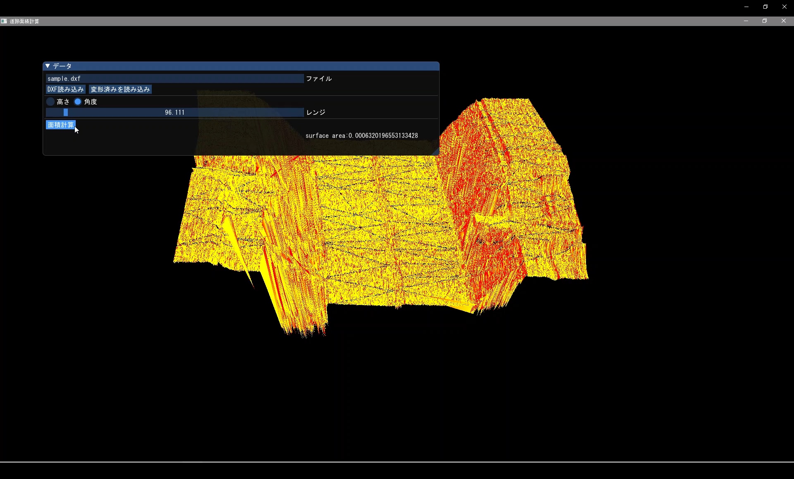
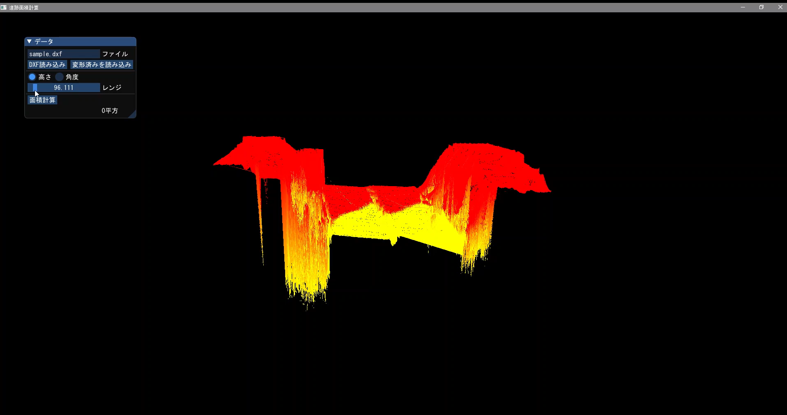

# view point data
DXF形式の点群データを読み込み表示し、メジャーで指定した長さを表示します

## 使用ライブラリ
silk(OpenGLのラッパー)

## 使用言語/OS
　C# (Windows Visual Studio)
## 動作の動画
Youtubeに操作した動画をアップロードしました
読み込みや計算は４倍速程度にしてます　本当はもっと遅いです

[動画](https://youtu.be/S0-xLF1bL_Q)

## 画面

